# XMail - Federated Encrypted Mail System

<p align="center">
  
  
  
  
  
</p>

> A self-hosted, zero-knowledge, end-to-end encrypted email platform delivered as a **single PHP file**.  
> No SMTP. No external mail servers. No plaintext ever touches disk.

---

## Table of Contents

- [Project Overview](#project-overview)
- [Security & Privacy Benefits](#security--privacy-benefits)
- [Features & Advantages](#features--advantages)
- [Installation Instructions](#installation-instructions)
- [php.ini Configuration](#phpini-configuration)
- [Usage Guide](#usage-guide)
  - [Registration & Login](#registration--login)
  - [Composing & Encrypting a Message](#composing--encrypting-a-message)
  - [Reading & Decrypting a Message](#reading--decrypting-a-message)
  - [Federation (Cross-Instance Messaging)](#federation-cross-instance-messaging)
  - [Attachments](#attachments)
  - [Drafts, Folders & Bulk Actions](#drafts-folders--bulk-actions)
  - [Admin Panel](#admin-panel)
- [Architecture Diagrams](#architecture-diagrams)
- [Repository Structure](#repository-structure)
- [License](#license)

---

## Project Overview

**XMail** is a self-hosted, federated, zero-knowledge encrypted messaging system packaged as a single file — `xmail.php`. It is designed for individuals, teams, and organisations that require private communication without dependency on commercial email infrastructure or third-party providers.

Unlike traditional email, XMail never stores or transmits message bodies in plaintext. Every message is encrypted on the server using **AES-256-GCM** before being written to disk. The encryption password is chosen by the sender at compose time and is **never stored** anywhere — not in the database, not in logs, not in the session. Only a recipient who knows the password can read the message.

XMail instances can communicate with each other over HTTP/HTTPS, enabling a federated network of private mail servers that interoperate without a central authority.

---

## Security & Privacy Benefits

XMail is built around a strict **zero-knowledge encryption model**. The following controls are in place to protect user data and enforce privacy at every layer.

### Zero-Knowledge Encryption

- Message bodies and all attachments are encrypted with **AES-256-GCM** before being written to the SQLite database or the filesystem.
- The encryption key is derived from a user-supplied password using **PBKDF2-SHA256 with 100,000 iterations** and a 16-byte cryptographic salt generated fresh for every message. This makes brute-force and pre-computation attacks computationally prohibitive.
- The ciphertext blob is structured as `base64(salt[16] | iv[12] | tag[16] | ciphertext)`, providing both confidentiality and authenticated integrity. Tampered ciphertexts are rejected outright.
- **The server never sees, stores, or transmits the message password.** If the server is compromised, the encrypted blobs are useless without the out-of-band password.

### Session-Scoped Password Caching

- Once a thread is unlocked, the decryption password is cached in the **server-side PHP session** (`$_SESSION['thread_keys']`) for the duration of the session only. It is not persisted to the database.
- All replies in a thread share the same password, keeping the UX frictionless while maintaining a consistent key boundary.

### CSRF Protection

- Every state-changing POST request is validated against a **cryptographically random CSRF token** (`bin2hex(random_bytes(24))`) stored in the session. Requests with missing or mismatched tokens are silently rejected.

### Attachment Security

- Attachments are encrypted using the same AES-256-GCM key as the message body before being written to the `attachments/` directory.
- An `.htaccess` file is automatically generated in `attachments/` to block direct HTTP access (`Deny from all`, `Options -Indexes`).
- A root-level `.htaccess` is also written to deny direct access to `*.db`, `*.sqlite`, and `*.sqlite3` files.
- Attachment file names are replaced with cryptographically random hex strings (`bin2hex(random_bytes(16))`), eliminating filename-based enumeration.
- MIME type validation is enforced server-side using `mime_content_type()` against an explicit allowlist; uploaded filenames cannot override the detected type.

### Input & Output Safety

- All HTML output is passed through `htmlspecialchars()` with `ENT_QUOTES | ENT_SUBSTITUTE` and `UTF-8` encoding to prevent XSS.
- Database access uses **PDO prepared statements** exclusively; no SQL is ever interpolated from user input.
- Account passwords are stored as **bcrypt hashes** via `password_hash($pw, PASSWORD_DEFAULT)` and verified with `password_verify()`.

### Federation Transport

- Federated delivery first attempts HTTPS, then falls back to HTTP. Deploying behind TLS ensures the encrypted payload is doubly protected in transit.
- The server does not log or inspect federation payloads beyond what is needed for delivery.

---

## Features & Advantages

| Feature | Details |
|---|---|
| **Single-file deployment** | The entire application is `xmail.php`. No framework, no composer, no build step. |
| **Zero-knowledge encryption** | AES-256-GCM + PBKDF2-SHA256 (100k iterations). Server never holds the key. |
| **Federated messaging** | Send to users on any other XMail instance using `user@host/xmail.php` addresses. |
| **Encrypted attachments** | Files are encrypted before storage; decrypted only for the authenticated recipient. |
| **Threaded conversations** | All replies in a thread are linked by `thread_uid` and share a single password. |
| **Full folder system** | Inbox, Sent, Drafts, Trash with unread counts and bulk operations. |
| **CC / BCC support** | Standard multi-recipient addressing with BCC header stripping for recipients. |
| **Drafts** | Messages can be saved as drafts and resumed later. |
| **Admin panel** | Manage users, toggle registration open/closed, promote/demote admins. |
| **Mobile-responsive UI** | Bottom navigation bar and responsive layout for small screens. |
| **SQLite backend** | No separate database server required. WAL mode enabled for concurrency. |
| **Self-contained `.htaccess` generation** | Automatically writes access controls for `attachments/` and the database file. |
| **No JavaScript required for core flows** | The UI degrades gracefully; JS is only used for sidebar toggling and bulk-select helpers. |

---

## Installation Instructions

### Prerequisites

- **PHP 8.0 or later** with the following extensions enabled:
  - `pdo_sqlite`
  - `openssl`
  - `fileinfo` (for MIME detection)
- A web server capable of running PHP (Apache, Nginx + PHP-FPM, Caddy, LiteSpeed, etc.)
- Write permissions on the directory where `xmail.php` is placed.

### Step 1 — Download the source

```bash
git clone https://github.com/xsukax/XMail.git
cd XMail
```

### Step 2 — Place the file

Copy or move `xmail.php` to the desired location in your web root:

```bash
cp xmail.php /var/www/html/xmail.php
```

Alternatively, run the application from its own subdirectory:

```bash
mkdir /var/www/html/xmail
cp xmail.php /var/www/html/xmail/xmail.php
```

### Step 3 — Set permissions

The web server process (e.g., `www-data`) must be able to **read and write** in the application directory, as XMail will auto-create `xmail.db` and the `attachments/` folder on first run.

```bash
chown -R www-data:www-data /var/www/html/xmail
chmod 750 /var/www/html/xmail
```

### Step 4 — Apache configuration (example)

```apache
<VirtualHost *:443>
    ServerName mail.example.com
    DocumentRoot /var/www/html/xmail

    <Directory /var/www/html/xmail>
        AllowOverride All
        Options -Indexes
        Require all granted
    </Directory>

    SSLEngine on
    SSLCertificateFile    /etc/letsencrypt/live/mail.example.com/fullchain.pem
    SSLCertificateKeyFile /etc/letsencrypt/live/mail.example.com/privkey.pem
</VirtualHost>
```

> Enable `AllowOverride All` so that XMail's auto-generated `.htaccess` rules take effect.

### Step 5 — Nginx configuration (example)

```nginx
server {
    listen 443 ssl;
    server_name mail.example.com;

    root /var/www/html/xmail;
    index xmail.php;

    ssl_certificate     /etc/letsencrypt/live/mail.example.com/fullchain.pem;
    ssl_certificate_key /etc/letsencrypt/live/mail.example.com/privkey.pem;

    location ~ \.php$ {
        fastcgi_pass unix:/run/php/php8.2-fpm.sock;
        fastcgi_index xmail.php;
        include fastcgi_params;
        fastcgi_param SCRIPT_FILENAME $document_root$fastcgi_script_name;
    }

    # Block direct access to the database and attachments
    location ~* \.(db|sqlite|sqlite3)$ { deny all; }
    location /attachments/ { deny all; }
}
```

### Step 6 — First run & admin account

Navigate to `https://mail.example.com/xmail.php` in your browser. You will be presented with the registration form. **The first registered user automatically becomes the administrator.**

---

## php.ini Configuration

XMail relies on standard PHP capabilities but the following `php.ini` directives should be reviewed and tuned for your deployment:

```ini
; ── Session security ──────────────────────────────────────────────────────────
session.cookie_httponly = 1        ; Prevent JS from reading the session cookie
session.cookie_secure   = 1        ; Send session cookie over HTTPS only
session.cookie_samesite = Lax      ; Mitigate CSRF via cross-site requests
session.use_strict_mode = 1        ; Reject unrecognised session IDs

; ── File uploads ──────────────────────────────────────────────────────────────
file_uploads      = On
upload_max_filesize = 12M          ; Must exceed XMail's MAX_ATTACH (default 10 MB)
post_max_size       = 15M          ; Should be larger than upload_max_filesize

; ── Execution limits ──────────────────────────────────────────────────────────
max_execution_time  = 60           ; Federation delivery of large encrypted payloads may take time
max_input_time      = 60

; ── OpenSSL / Crypto ──────────────────────────────────────────────────────────
; Ensure the openssl extension is enabled (usually the default)
; extension=openssl

; ── PDO SQLite ────────────────────────────────────────────────────────────────
; extension=pdo_sqlite

; ── Error handling (production) ───────────────────────────────────────────────
display_errors  = Off
log_errors      = On
error_log       = /var/log/php/xmail_errors.log
```

> **Important:** Set `session.cookie_secure = 1` only after enabling HTTPS on your server, otherwise sessions will not be created at all.

---

## Usage Guide

### Registration & Login

1. Open `https://your-domain/xmail.php` in a browser.
2. Click **Register** and choose a username and password. The username becomes the local part of your XMail address (e.g., `alice@mail.example.com/xmail.php`).
3. Log in with your credentials to access the inbox.

> Your **account password** is for logging into XMail only. It is completely separate from the **message passwords** used for encryption.

---

### Composing & Encrypting a Message

```
?page=compose
```

1. Enter one or more recipients in the **To** field using XMail addresses (`user@host/xmail.php`). Separate multiple addresses with commas, semicolons, or spaces.
2. Optionally add **CC** and **BCC** recipients.
3. Enter a **Subject** (stored in plaintext) and a **Message Body**.
4. Set a **Message Password**. This password encrypts the body and all attachments. Share it with your recipient through a separate, secure channel (e.g., a phone call or Signal message).
5. Optionally attach files (max 10 MB per file). They are encrypted before storage.
6. Click **Send** to deliver, or **Save Draft** to resume later.

> The message password is never sent to the server after encryption. **Do not lose it** — there is no recovery mechanism.

---

### Reading & Decrypting a Message

1. Open the **Inbox** (`?page=inbox`).
2. Click on a message subject to open the thread view.
3. If the thread has not been unlocked in the current session, an **Enter password** prompt is shown.
4. Enter the message password. XMail derives the AES-256-GCM key, decrypts the body and attachments, and displays the thread.
5. The password is cached in the session for the remainder of the thread conversation; you will not be prompted again until you log out or the session expires.

---

### Federation (Cross-Instance Messaging)

XMail uses a lightweight HTTP-based federation protocol. Addressing follows the pattern:

```
username@hostname/path/to/xmail.php
```

**Example:** Sending from `alice@server-a.com/xmail.php` to `bob@server-b.org/xmail.php`

- XMail first resolves the recipient via `GET https://server-b.org/xmail.php?api=resolve&user=bob`.
- It then delivers the encrypted payload via `POST https://server-b.org/xmail.php?api=receive`.
- The encrypted body and attachments are embedded in the JSON payload; no plaintext is transmitted.
- If HTTPS delivery fails, XMail falls back to HTTP (strongly discouraged in production; use TLS).

---

### Attachments

- Supported file types: JPEG, PNG, GIF, WebP, PDF, plain text, CSV, ZIP, DOC/DOCX, XLS/XLSX.
- Maximum size: **10 MB per file** (configurable via the `MAX_ATTACH` constant in `xmail.php`).
- Encrypted attachments can only be downloaded after the thread password has been entered.
- Attachment files on disk use random hex filenames to prevent enumeration.

---

### Drafts, Folders & Bulk Actions

| Folder | Path | Description |
|---|---|---|
| Inbox | `?page=inbox` | Received messages |
| Sent | `?page=sent` | Messages you have sent |
| Drafts | `?page=drafts` | Saved unsent messages |
| Trash | `?page=trash` | Deleted messages (recoverable) |

**Bulk actions** available from any folder listing:

- Mark as read / unread
- Move to trash
- Restore from trash
- Permanently delete (from Trash only)

Select rows with the checkboxes and choose an action from the bulk-action bar that appears.

---

### Admin Panel

Accessible at `?page=admin` for users with the administrator role.

- **Toggle registration** — Switch between open (anyone can register) and closed (no new accounts).
- **User list** — View all registered users with their roles and join dates.
- **Promote / demote** — Grant or revoke admin privileges for any user other than yourself.
- **Delete user** — Permanently removes a user account and all associated mail and attachments.

---

## Architecture Diagrams

### Encryption Flow — Sending a Message

```mermaid
sequenceDiagram
    actor Sender
    participant Browser
    participant XMail as xmail.php (Server)
    participant DB as xmail.db (SQLite)
    participant FS as attachments/

    Sender->>Browser: Compose message + set password
    Browser->>XMail: POST (subject, body, attachments, password)

    Note over XMail: random_bytes(16) → salt<br/>random_bytes(12) → IV
    XMail->>XMail: PBKDF2(password, salt, 100k) → key
    XMail->>XMail: AES-256-GCM encrypt(body, key, IV) → ciphertext

    alt Has attachments
        XMail->>XMail: AES-256-GCM encrypt(file_bytes, key) → enc_file
        XMail->>FS: Write enc_file as random_hex_name
    end

    XMail->>DB: INSERT mails (subject, ciphertext, …)
    Note over XMail: Password is discarded — never stored

    XMail-->>Browser: Redirect to Sent
```



---

### Decryption Flow — Reading a Message

```mermaid
sequenceDiagram
    actor Recipient
    participant Browser
    participant XMail as xmail.php (Server)
    participant DB as xmail.db (SQLite)
    participant FS as attachments/
    participant Session as PHP Session

    Recipient->>Browser: Open thread
    Browser->>XMail: GET ?uid=<thread_uid>
    XMail->>Session: Check thread_keys[thread_uid]

    alt Password not in session
        XMail-->>Browser: Render "Enter password" form
        Recipient->>Browser: Enter message password
        Browser->>XMail: POST password
    end

    XMail->>DB: Fetch body_enc
    XMail->>XMail: PBKDF2(password, salt) → key
    XMail->>XMail: AES-256-GCM decrypt(ciphertext, key) → plaintext

    alt Decryption succeeds
        XMail->>Session: Cache password for thread
        XMail->>FS: Read enc_file → decrypt → stream to browser
        XMail-->>Browser: Render plaintext thread
    else Wrong password or corrupted data
        XMail-->>Browser: Show "🔒 Could not decrypt" error
    end
```



---

### Federation Delivery Flow


---

### Data Model


---

## Repository Structure

```
XMail/
├── xmail.php          # The entire application — single entry point
├── xmail.db           # SQLite database (auto-created on first run, do not commit)
├── attachments/       # Encrypted attachment storage (auto-created on first run)
│   └── .htaccess      # Auto-generated; blocks direct HTTP access
├── .htaccess          # Auto-generated; blocks direct access to .db files
└── README.md          # This file
```

> **Note:** `xmail.db` and `attachments/` are created automatically at runtime. They should be excluded from version control (add them to `.gitignore`) and included in your backup strategy.

```gitignore
xmail.db
attachments/
.htaccess
```

---

## License

This project is licensed under the **GNU General Public License v3.0** — see [https://www.gnu.org/licenses/gpl-3.0.html](https://www.gnu.org/licenses/gpl-3.0.html) for the full terms.
